# 工程项目专项方案智能编制平台 — 技术架构文档

**版本**：v5.3
**更新日期**：2026-09-18
**文档状态**：已发布
**对齐代码版本**：`APP_VERSION = 5.3.0`
**核心场景**：工程项目专项方案编制、目录生成与识别、正文编写、图表与计算书插入、审核与预检、导出 DOCX
---

## 〇、修订说明

### 0.1 本次架构核心变化：以代码为准重建架构描述

v5.2 的架构图与目录结构写于 2026-09-10，此后代码经历三轮大规模增强，**模块拆分、职责划分与关键路径已发生结构性变化**。本次基于全量代码扫描重建，所有图示与路径均对应当前实现。

| 变化类型 | 内容 |
| -------- | ---- |
| 目录结构重建 | `services/ai/workflows_outline.py` / `workflows_content.py` / `ai_monitor.py` 已不存在（正文/目录工作流合并进 `routers/sse_handlers.py`，4059 行）；`routers/ai/`、`batch.py`、`monitoring.py`、`websocket.py`、`duplicate.py`、`images.py`、`files.py`、`project_documents.py` 已移除或合并 |
| 新增模块 | `preflight_engine`、`audit_rules`、`audit_scoring`、`consistency_scanner`、`conflict_arbiter`、`repair_agent`、`repair_validator`、`repair_record`、`standards_registry`、`content_polish`、`content_shrink`、`docx_math`、`mineru_client`、`ocr`、`file_parser`、`facts_extractor`、`facts_cross_validators`、`outline_reorganize`、`outline_reference`、`outline_templates`、`chart_payload`、`http_pool`、`activity_broadcaster`、`image_providers/`（8 家）、`mermaid_*`（7 个渲染器 + common） |
| 图表范式变更 | 编排提名三段式 → **正文一体内嵌代码块** + PIL v2 内置渲染 |
| 审核体系变更 | 五个独立检查 → **六维加权就绪度评分 + 程序化预检引擎** |
| 前端结构变更 | 22 个独立页面 → **7 条路由 + 方案工作台单页 8 区块**；状态管理由 Zustand 改为 React Router + hooks |
| 依赖版本更新 | FastAPI 0.139 / uvicorn 0.49 / Starlette 1.3.1 / antd 5.29 / React Router 7.18；新增 PyMuPDF、orjson、loguru、rich、katex、dompurify、vitest |
| 安全补强 | 新增 `ApiAuthMiddleware`；解析侧压缩比/解压量闸门；`secrets.compare_digest` bytes 化 |

### 0.2 明确不包含
投标文件编写相关能力（招标解析、评分对齐、废标检查、投标响应、商务/报价/资格文件、评标办法匹配）不含在本架构内。
> 命名说明：代码中的 `bid_analysis_service.py` / `bid_analysis.py` / 表 `bid_analysis_items` 沿用历史命名，**实际职责是「项目资料结构化提取」（18 项维度），与投标无关**；`bid_section_detector.py` 与表 `bid_sections` 为未接线的移植遗留，计划清理。

---

## 图表索引

| 编号 | 图表名称 | 类型 | 所在章节 |
| ---- | -------- | ---- | -------- |
| 图 1-1 | 系统分层架构总览 | flowchart | 一 |
| 图 2-1 | 后端目录结构（实际） | text | 二 |
| 图 2-2 | 后端模块依赖关系 | flowchart | 二 |
| 图 2-3 | Provider 体系类图 | classDiagram | 二 |
| 图 2-4 | AI 降级链与可靠性决策 | flowchart | 二 |
| 图 2-5 | AI 熔断器状态机 | stateDiagram | 二 |
| 图 2-6 | 自适应并发控制流程 | flowchart | 二 |
| 图 3-1 | 前端结构（实际） | text | 三 |
| 图 3-2 | 方案工作台八大区块 | flowchart | 三 |
| 图 3-3 | 前端路由与组件依赖 | flowchart | 三 |
| 图 4-1 | 项目资料数据链总览 | flowchart | 四 |
| 图 4-2 | 目录生成时序图 | sequenceDiagram | 四 |
| 图 4-3 | 正文与图表同步生成时序图 | sequenceDiagram | 四 |
| 图 4-4 | 图表渲染与登记流水线 | flowchart | 四 |
| 图 4-5 | 文件解析多通道与闸门 | flowchart | 四 |
| 图 4-6 | 全局事实提取管线 | flowchart | 四 |
| 图 4-7 | 一致性 Agent 修复闭环 | flowchart | 四 |
| 图 4-8 | 六维就绪度评分与程序化预检 | flowchart | 四 |
| 图 4-9 | 导出流水线 | flowchart | 四 |
| 图 5-1 | 数据库 ER 图 | erDiagram | 五 |
| 图 7-1 | 弱模型稳定 JSON 工作流 | flowchart | 七 |
| 图 8-1 | 中间件执行顺序与鉴权 | flowchart | 八 |
| 图 9-1 | 部署拓扑图 | flowchart | 九 |
| 图 11-1 | 方案生命周期状态机 | stateDiagram | 十一 |
| 图 11-2 | 章节状态机 | stateDiagram | 十一 |
| 图 11-3 | 章节审核状态机 | stateDiagram | 十一 |
| 图 11-4 | 目录库审核状态机 | stateDiagram | 十一 |
| 图 11-5 | 任务状态机 | stateDiagram | 十一 |
| 图 11-6 | 一致性修复状态机 | stateDiagram | 十一 |

---

## 一、技术栈总览

### 图 1-1 系统分层架构总览

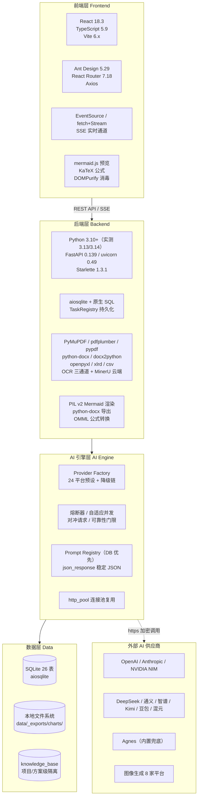

**分层职责说明**：
| 层 | 职责 | 关键技术 |
| -- | ---- | -------- |
| 前端层 | 页面渲染、目录树编辑、SSE 进度消费、图表预览、凭据管理 | React 18.3 + antd 5.29 + React Router 7.18 |
| 后端层 | 业务路由、任务调度、文档解析、DOCX/PDF 导出 | FastAPI 0.139 + aiosqlite + TaskRegistry |
| AI 引擎层 | 多供应商调度、提示词管理、稳定 JSON、并发与熔断 | Provider Factory + 对冲请求 + 自适应并发 |
| 数据层 | 持久化、缓存、文件存储、知识库 | SQLite（26 表）+ 本地文件系统 |

---

## 二、后端架构

### 图 2-1 后端目录结构（实际）

```text
backend/
├── app/
│   ├── main.py                  # FastAPI 入口（267 行）：lifespan 启动恢复、能力自检、提示词 API
│   ├── config.py                # 配置（pydantic-settings，118 行）：AI/OCR/MinerU/鉴权/并发参数
│   ├── db.py                    # 数据库连接（684 行，aiosqlite + 死线程检测 + 自动建表）
│   ├── models.py                # Pydantic 数据模型（251 行）
│   ├── middleware.py            # CORS / 请求日志 / ApiAuth 鉴权（171 行）
│   ├── schema_sql.py            # 建表 SQL（435 行，26 张表）
│   ├── seed_data.py             # 专项方案清单预置（265 行，12 分类 / 141 模板）
│   ├── routers/                 # 16 个路由模块
│   │   ├── sse_handlers.py      # ★ 核心（4059 行）：目录/正文/事实生成 + 任务控制
│   │   ├── _chart_pipeline.py   # 正文内联图表：提取 → 校验 → 修复 → 登记
│   │   ├── export.py            # ★ 导出（2760 行）：DOCX/PDF/格式预设/缓存/预检
│   │   ├── global_facts.py      # 全局事实（1490 行）+ 项目资料 /documents 子路由
│   │   ├── ai_config.py         # AI 配置（1301 行）：供应商/模型/降级链/审计/统计
│   │   ├── bid_analysis.py      # 提取项目（1027 行）：18 项结构化提取 + SSE
│   │   ├── compliance.py        # 规范符合性 + 专家论证预检 + 程序化预检 + 评分（638 行）
│   │   ├── outline_library.py   # 专项方案目录库（635 行）
│   │   ├── sections.py          # 章节管理（582 行）
│   │   ├── charts.py            # 图表预测 / Mermaid 生成 / 渲染 / AI 生图（593 行）
│   │   ├── consistency_repair.py# 一致性 Agent 修复（337 行）
│   │   ├── review.py            # 方案/章节审核工作流（280 行）
│   │   ├── upload_outline.py    # 上传目录识别（442 行）
│   │   ├── schemes.py / projects.py / knowledge.py
│   │   ├── scheme_catalog.py    # 方案清单（66 行）
│   │   └── system.py            # 系统活动聚合（183 行）：轮询 + SSE
│   ├── services/                # 31 个业务服务
│   │   ├── file_parser.py       # ★ 文件解析（1269 行，8 格式 + 安全闸门）
│   │   ├── facts_extractor.py   # ★ 全局事实提取（2141 行）
│   │   ├── facts_cross_validators.py  # 交叉校验（429 行，零 LLM）
│   │   ├── bid_analysis_service.py    # 18 项维度提取（707 行）
│   │   ├── preflight_engine.py  # 程序化预检（566 行，确定性规则）
│   │   ├── audit_rules.py       # 审核规则单一事实源（428 行）
│   │   ├── audit_scoring.py     # 六维就绪度评分（260 行）
│   │   ├── consistency_scanner.py / conflict_arbiter.py
│   │   ├── repair_agent.py / repair_validator.py / repair_record.py
│   │   ├── standards_registry.py      # 现行/废止标准库（307 行）
│   │   ├── content_polish.py / content_shrink.py / content_utils.py
│   │   ├── docx_math.py         # LaTeX→OMML + 乱码修复（575 行）
│   │   ├── ocr.py               # OCR 三通道（407 行）
│   │   ├── mineru_client.py     # MinerU 云端解析（265 行）
│   │   ├── outline_templates.py # 标准目录模板库（2407 行）
│   │   ├── outline_reorganize.py / outline_reference.py / outline_utils.py
│   │   ├── chart_validators.py（1829 行）/ chart_payload.py
│   │   ├── activity_broadcaster.py / crypto.py / knowledge.py / audit_*.py
│   └── services/ai/             # AI 基础设施
│       ├── provider_factory.py  # ★ 供应商工厂（1417 行）：24 平台 + 降级 + 对冲 + 审计
│       ├── providers/           # base / openai_compatible / anthropic_compatible
│       ├── image_engine.py（854 行）+ image_providers/  # 8 家图像平台适配器
│       ├── prompts/             # _registry / _cache / _shared / _norm_dicts
│       │                        # outline / content / charts / analysis
│       │                        # consistency_repair / illustration
│       ├── mermaid_renderer.py  # facade（1057 行）
│       │   ├── mermaid_common / flowchart / gantt / architecture
│       │   └── comparison / labor / layout / timeline
│       ├── mermaid_service.py   # 可选外置渲染后端（Docker/Railway/mmdc）
│       ├── json_response.py     # 稳定 JSON（384 行）
│       ├── task_registry.py     # 任务持久化（344 行）
│       ├── workflows_base.py    # 自适应并发 / 熔断器 / 信号量
│       ├── heading_standard.py（兼容层）+ heading_templates / heading_v1 / heading_v2
│       ├── http_pool.py         # 进程级 httpx 连接池
│       └── sse_utils.py         # SSE 心跳包装
├── requirements.txt             # 已锁定版本（pip install -r）
└── tests/                       # 56 个测试文件
```

### 图 2-2 后端模块依赖关系

```mermaid
flowchart LR
    subgraph R["Routers 路由层（16）"]
        R1[sse_handlers ★]
        R2[projects / schemes / sections]
        R3[outline_library / upload_outline / scheme_catalog]
        R4[global_facts / bid_analysis]
        R5[compliance / consistency_repair / review]
        R6[export / charts / _chart_pipeline]
        R7[ai_config / knowledge / system]
    end
    subgraph S["Services 业务层（31）"]
        S1[file_parser + ocr + mineru_client]
        S2[facts_extractor + facts_cross_validators]
        S3[bid_analysis_service]
        S4[preflight_engine + audit_rules + audit_scoring]
        S5[consistency_scanner + conflict_arbiter + repair_*]
        S6[content_polish + content_shrink + standards_registry]
        S7[outline_templates + reorganize + reference + utils]
        S8[chart_validators + chart_payload]
        S9[docx_math + crypto + activity_broadcaster]
    end
    subgraph A["AI 基础设施"]
        A1[provider_factory]
        A2[prompts registry + cache]
        A3[json_response]
        A4[task_registry]
        A5[mermaid_renderer + 7 子模块]
        A6[image_engine + image_providers]
        A7[http_pool]
        A8[workflows_base: 并发/熔断]
        A9[heading_v1 / v2 / templates]
    end
    subgraph D["数据层"]
        D1[(SQLite 26 表)]
        D2[(文件系统 data/)]
    end
    R --> S
    R --> A
    S --> A
    S --> D
    A --> D
    A3 --> A1
    A5 --> A2
    A6 --> A1
```

### 2.3 核心设计模式

#### 2.3.1 Provider 工厂模式

```python
# provider_factory.py
def get_working_provider(ai_config: dict) -> tuple[Provider, str]:
    """
    优先级链：
    1. 当前保存的配置（ai_config 表，is_active + priority）
    2. 其余配置按 priority 排序作为降级候选（上限 ai_fallback_chain_max = 3）
    3. 内置兜底（Agnes）
    运行时依据最近 24h 成功率剔除死配置（< 0.20）与后置弱配置（< 0.60）
    """
```

**图 2-3 Provider 体系类图**

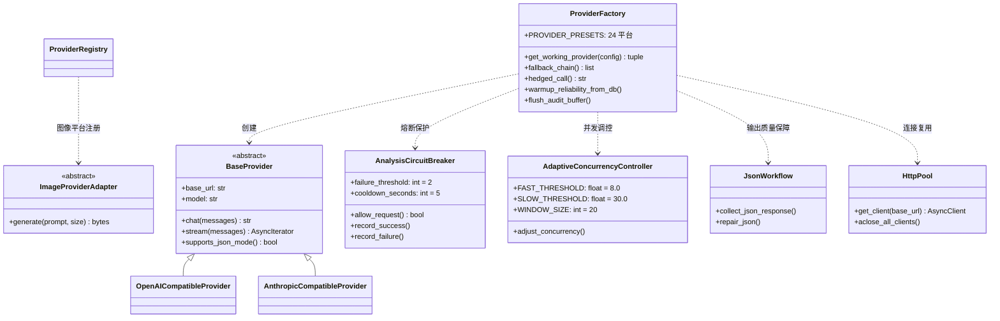

#### 图 2-4 AI 降级链与可靠性决策

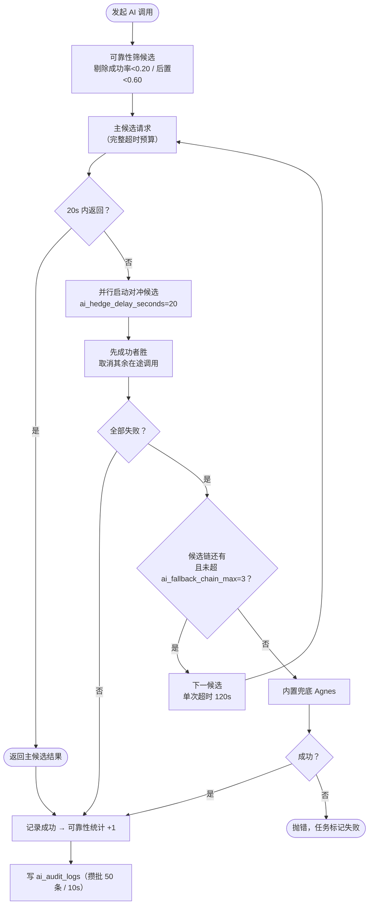

#### 图 2-5 AI 熔断器状态机

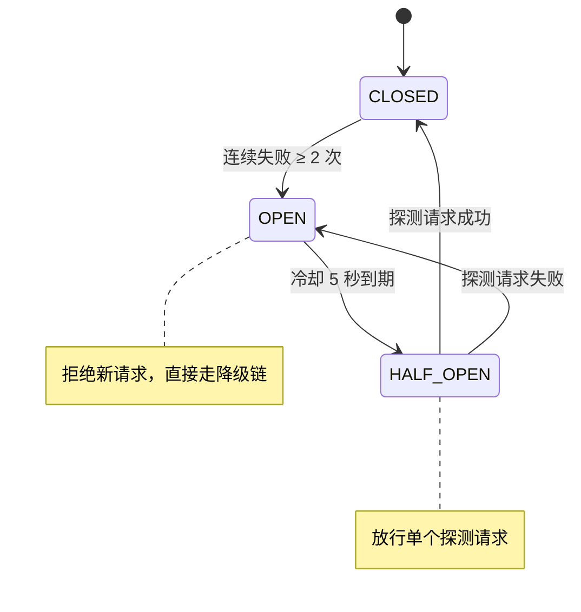

#### 2.3.3 自适应并发控制

```python
# workflows_base.py
class AdaptiveConcurrencyController:
    """根据 AI 响应时间动态调整并发数（窗口大小 20）"""
    FAST_THRESHOLD = 8.0   # < 8s 且 failure_rate < 0.05 → 增加并发
    SLOW_THRESHOLD = 30.0  # > 30s 或 failure_rate > 0.3 → 降低并发
    WINDOW_SIZE = 20
    _RATE_LIMIT_FAST_DOWNGRADE_THRESHOLD = 2  # 连续 429 降速触发阈值

# 全局硬上限：settings.max_concurrency = 5，default_concurrency = 3
# 由 ResizableSemaphore 承载，启动时 apply_config_concurrency() 按活跃配置调整
```

**图 2-6 自适应并发控制流程**

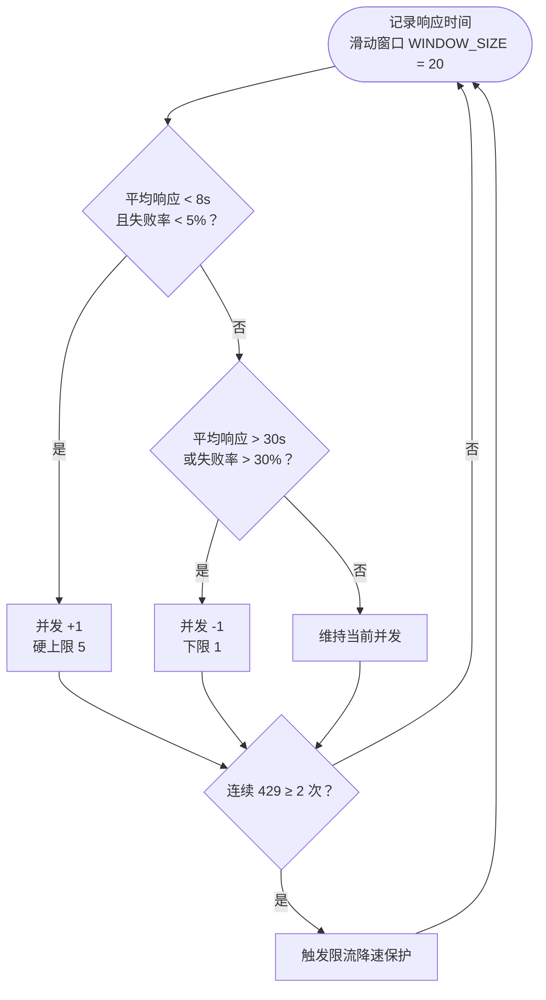

#### 2.3.4 Prompt 注册表模式

```python
# _registry.py
_ALL_PROMPTS: dict[str, dict] = {}
def _reg(key: str, category: str, label: str, value: str) -> str:
    """注册提示词并自动提取变量（{var} 与 __CONSTANT__）"""
    variables = extract_variables(value)
    _ALL_PROMPTS[key] = {"category": category, "label": label,
                         "content": value, "variables": variables}
    return value

# ⚠️ 变量替换是「正则替换」不是 str.format()：
#    JSON 示例里的 {...} 无需转义；写 {{ 会原样渲染成 {{。
# _cache.py 实现「DB 优先、回退硬编码」：
#    get_prompt() 优先返回 prompt_templates 表内容，缺失回退 _ALL_PROMPTS
#    出厂默认基线由 get_default_prompt(key) 常量持有，**不落库**
```

#### 2.3.5 全局事实变量注入

```python
# sse_handlers.py
def _build_facts_text(db, scheme_id, max_total=3000) -> str:
    """构建结构化「项目关键事实」文本，目录生成与正文生成共用同一函数"""

# 归一化字典（_norm_dicts.py）是单一事实源：
#   Prompt 里让模型怎么写 == 代码里怎么比，避免两侧口径不一致
#   型号代码（QTZ80 / PC220 / XCMG-ZL50）不归一，原样保留
```

#### 2.3.6 程序化预检与六维评分

```python
# audit_rules.py —— 审核规则单一事实源（六维）
DIMENSIONS = (
    Dimension("completeness",   "内容完整性",     25, ...),
    Dimension("compliance",     "规范符合性",     20, ...),
    Dimension("safety",         "安全措施有效性", 20, ...),
    Dimension("consistency",    "全文一致性",     15, ...),
    Dimension("traceability",   "可追溯性",       10, ...),
    Dimension("deliverability", "可交付性",       10, ...),
)

# preflight_engine.py —— 确定性规则，纯本地计算
def run_preflight(ctx: PreflightContext) -> list:
    for fn in (check_completeness, check_standards, check_safety,
               check_consistency, check_traceability, check_deliverability):
        findings.extend(fn(ctx))
```

---

## 三、前端架构

### 图 3-1 前端目录结构（实际）

```text
frontend/src/                     （19,211 行 TS/TSX）
├── main.tsx / App.tsx            # 7 条路由
├── api/index.ts                  # Axios 客户端 + getApiToken()（localStorage: api_token）
├── types/audit.ts                # 审核与评分类型
├── hooks/useSchemeLiveTask.ts    # 方案实时任务订阅
├── utils/
│   ├── activityCenter.ts         # 后台活动中心（SSE 订阅）
│   ├── exportCharts.ts           # 图表导出工具
│   ├── theme.ts / ui.tsx
│   └── workflowDerived.ts        # 工作流派生状态（进度/阶段文案）
├── components/
│   ├── Layout.tsx                # 侧边栏 + 面包屑 + 标题
│   ├── TaskStatusBar.tsx         # 后台任务运行状态栏
│   ├── ActivityHint.tsx          # 活动提示
│   ├── MarkdownRenderer.tsx      # Markdown + KaTeX + DOMPurify
│   ├── SectionContentCard.tsx    # 章节内容卡片
│   ├── OutlineLibraryEditModal.tsx
│   ├── mermaidRuntime.ts         # mermaid.js 动态加载与渲染
│   └── review/
│       ├── ReviewWorkflowPanel.tsx   # 审核工作流
│       └── ReadinessDashboard.tsx    # 就绪度看板
└── pages/
    ├── ProjectListPage.tsx
    ├── ProjectDetailPage.tsx
    ├── SchemeWorkbenchPage.tsx   # ★ 核心单页（8,479 行，8 大区块）
    ├── OutlineLibraryPage.tsx
    ├── AIConfigPage.tsx
    ├── PromptEditorPage.tsx
    └── SecuritySettingsPage.tsx  # 访问凭据
└── tests/                        # 7 个测试文件
    ├── securitySettings.test.tsx    # 凭据键名契约
    ├── sseFetch.test.ts             # SSE fetch 流
    ├── mermaidRuntime.test.ts       # mermaid 运行时
    ├── exportCharts.test.ts         # 图表导出
    ├── factsApi.test.ts             # 事实 API
    ├── MarkdownRenderer.test.tsx    # Markdown 渲染
    └── workflowDerived.test.ts      # 工作流派生
```

### 图 3-2 方案工作台八大区块

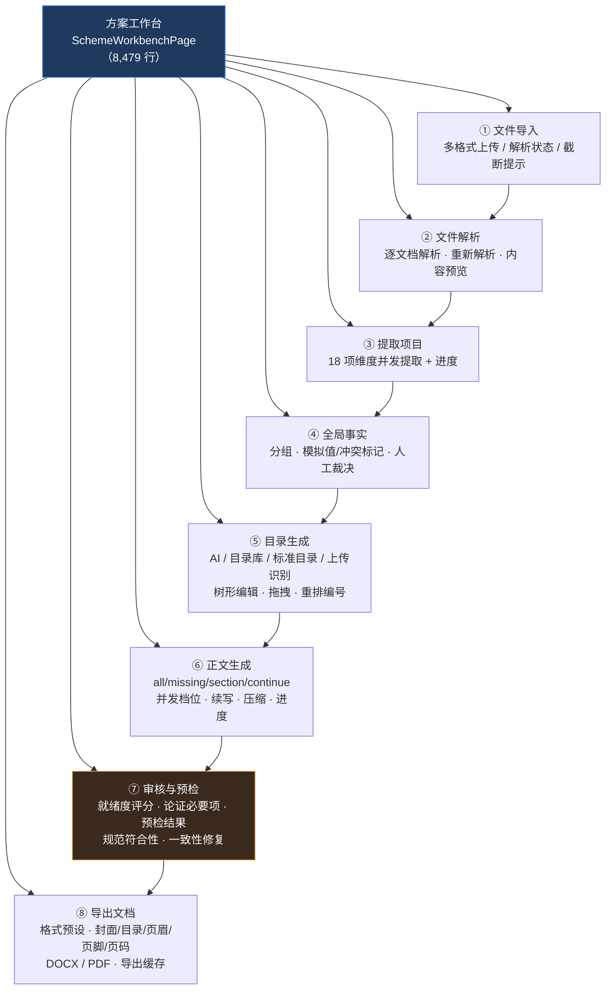

### 图 3-3 前端路由与组件依赖

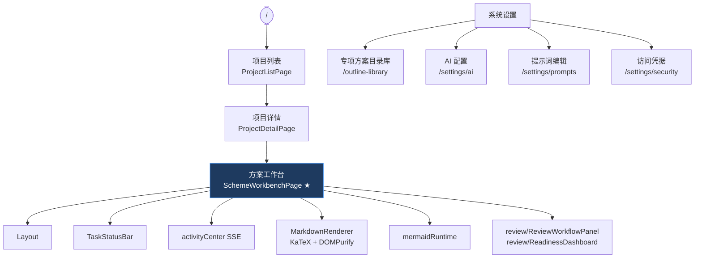

### 3.4 前端关键约定

| 约定 | 说明 |
| ---- | ---- |
| 状态管理 | 未使用 Zustand；采用 React hooks + `useSchemeLiveTask` + `activityCenter` 订阅 |
| 凭据注入 | `api/index.ts::getApiToken()` 读 `localStorage.api_token`；`VITE_API_TOKEN` 优先于 localStorage（构建期写死时页面告警） |
| 阶段文案 | 优先消费后端 `stats.phase_label`；不按进度区间硬编码推断（stats 未到达时才回退） |
| SSE 消费 | `fetch + Stream` 与 `EventSource` 双通道（`sseFetch.ts` 已测）；树更新 50ms 防抖合并 |
| 图表预览 | 前端 mermaid.js 预览；与后端 PIL v2 共用同一份「Mermaid 关键字 → 图表类型」映射 |
| 新增页面 | 需同步改 6 处：`App.tsx` lazy import + Route、`Layout.tsx` items（展开/折叠）、面包屑、`pageTitle`、`selectedKey` |

---

## 四、数据流架构

### 图 4-1 项目资料数据链总览

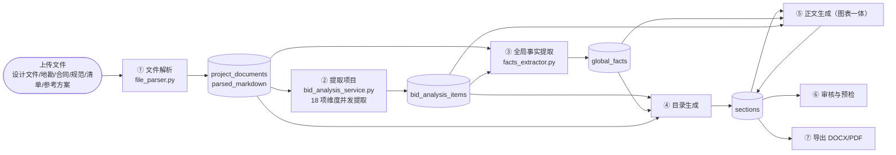

### 图 4-2 目录生成时序图

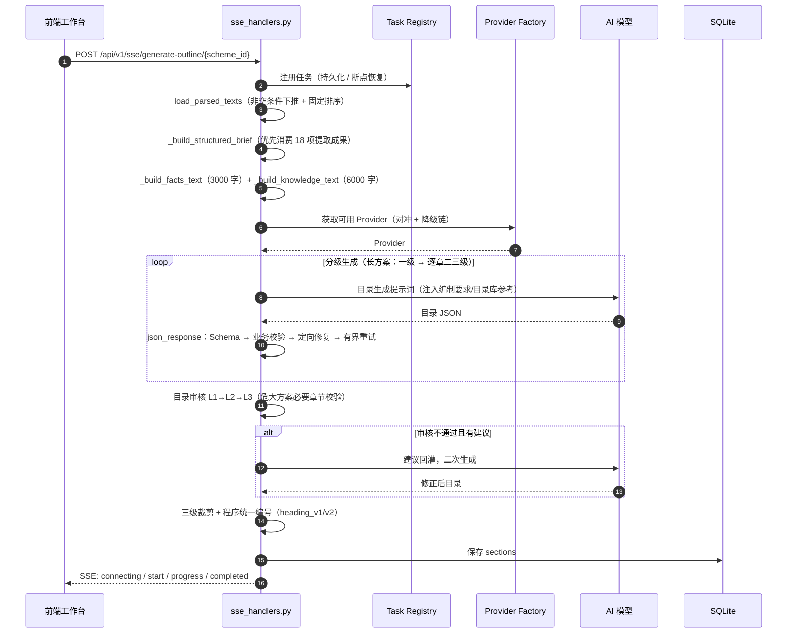

### 图 4-3 正文与图表同步生成时序图

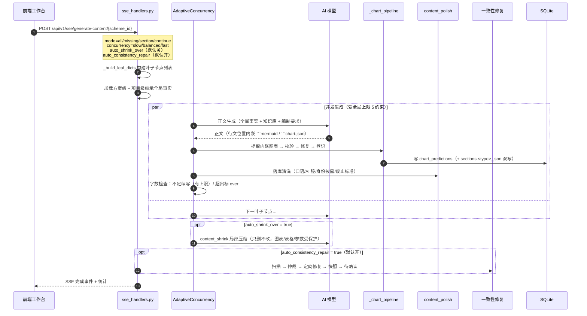

### 图 4-4 图表渲染与登记流水线

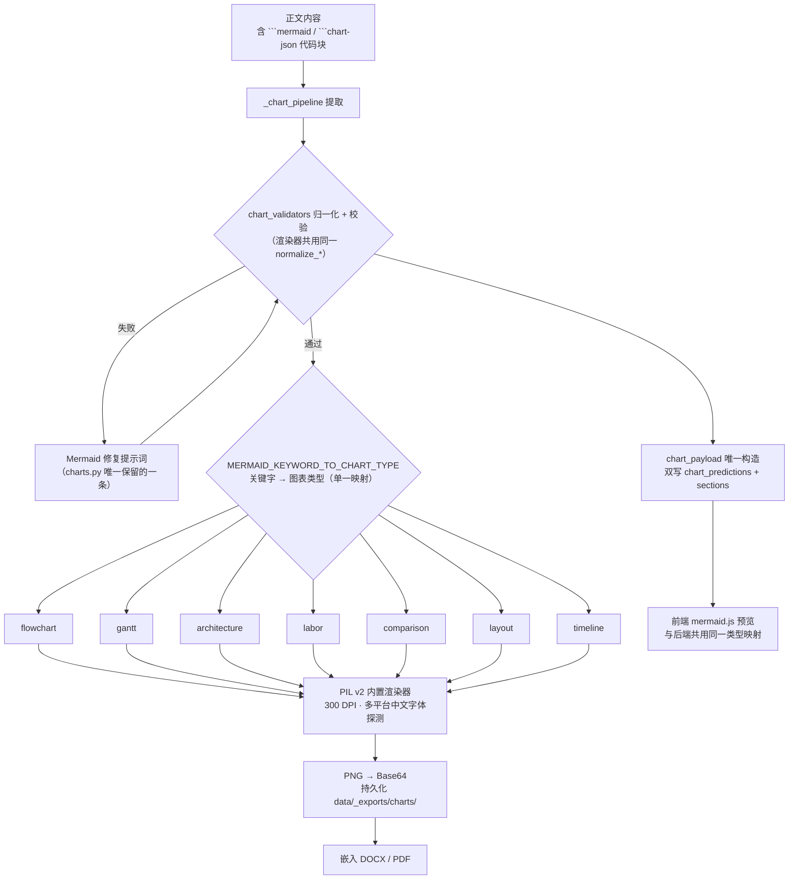

### 图 4-5 文件解析多通道与闸门

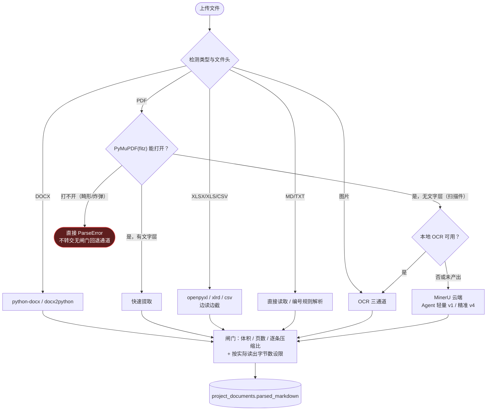

### 图 4-6 全局事实提取管线

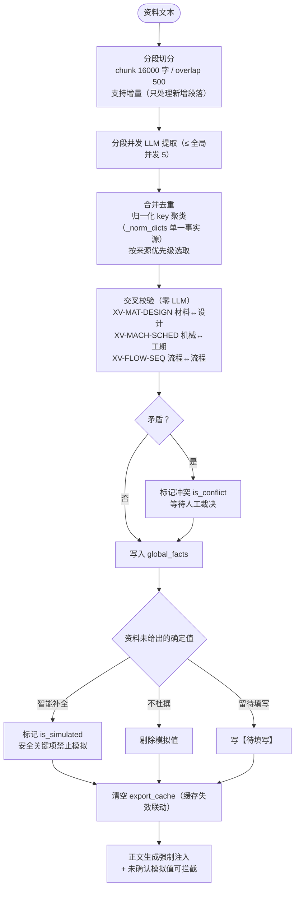

### 图 4-7 一致性 Agent 修复闭环

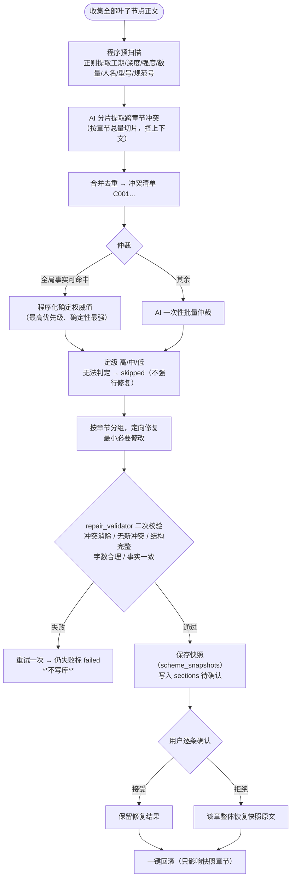

### 图 4-8 六维就绪度评分与程序化预检

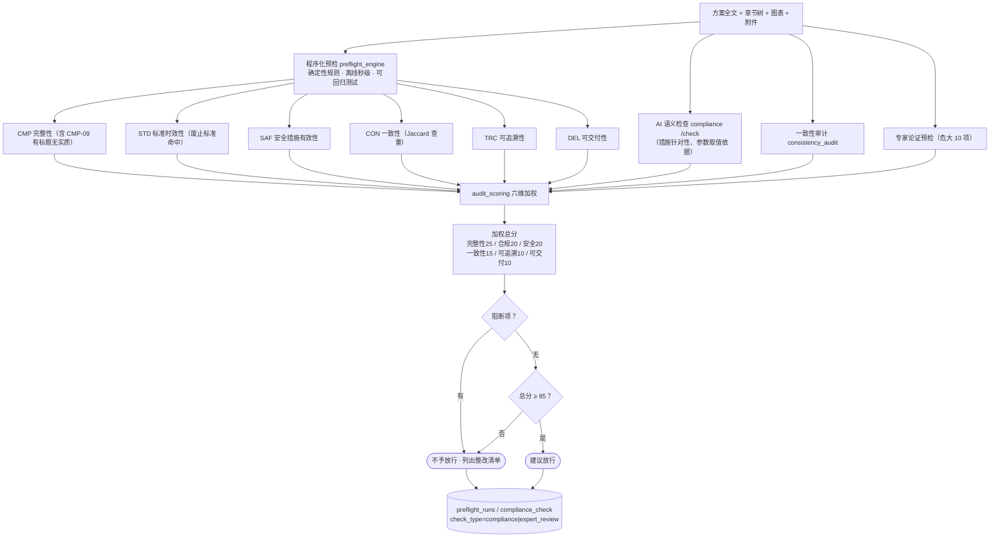

### 图 4-9 导出流水线

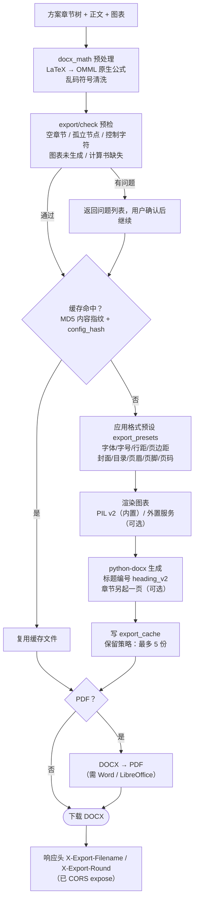

---

## 五、数据库设计

### 图 5-1 核心数据实体关系图（26 张表）

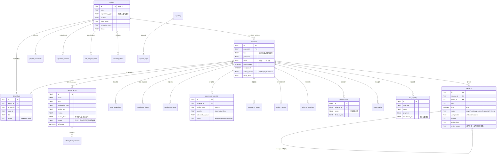

### 5.2 关键表与字段

| 表 | 关键字段 | 说明 |
| -- | -------- | ---- |
| `sections` | `level`(1-3)、`status`、`review_status`、`word_status` | 目录树只留三级；审核状态与方案状态解耦 |
| `outline_library` / `outline_library_versions` | `outline_json`、`version`、`review_status`、`ref_count` | 版本管理与审核 |
| `uploaded_outlines` | `confidence`(REAL) | 识别置信度 0-1，< 0.7 前端高亮 |
| `project_documents` | `parsed_markdown`、`doc_type` | 文件解析结果 |
| `bid_analysis_items` | `item_id`、`status`、`result` | 18 项结构化提取结果（`bid_*` 命名沿革） |
| `global_facts` | `group_id`、`is_simulated`、`is_resolved`、`has_conflict`、`confidence` | 模拟值与冲突标记 |
| `facts_extracted_chunks` | `chunk_index`、`status` | 分段提取增量状态 |
| `chart_predictions` | `chart_type`、`needed`、`priority`、`data_json` | 图表清单（导出主数据源） |
| `consistency_conflicts` | `conflict_code`、`severity`、`authoritative_value`、`status` | 冲突清单与仲裁结果 |
| `consistency_repairs` / `scheme_snapshots` | `status` / `payload_json` | 修复批次与回滚快照 |
| `preflight_runs` | `score`、`findings_json` | 程序化预检运行记录 |
| `compliance_check` | `check_type`(compliance / expert_review)、`severity` | 合规与论证预检 |
| `export_cache` | `config_hash`、`content_fingerprint`、`cache_key`、`result_path` | 指纹缓存 |
| `export_presets` | `scope`、`name`、`config_json`、`is_default` | 导出格式预设 |
| `ai_config` | `api_key_encrypted`、`priority`、`is_active`、`concurrency` | 多供应商与优先级 |
| `ai_audit_logs` | `provider`、`model`、`tokens`、`latency_ms`、`success` | 调用审计（攒批落库） |
| `prompt_templates` | `key`、`content` | 只消费 key/content 两列；出厂基线不落库 |

### 5.3 索引策略
`sections.scheme_id`、`sections.parent_id`、`outline_library.type`、`global_facts.scheme_id`、`compliance_check.scheme_id`、`task_registry.status`、`ai_audit_logs.created_at`。

---

## 六、API 接口清单

| 模块 | 核心端点 |
| ---- | -------- |
| 健康检查 / 能力 | `GET /api/v1/health`；`GET /api/v1/diagnostics/capabilities`（OCR / 图表 / 解析器可用性） |
| 项目管理 | `GET/POST /api/v1/projects`；`GET/PATCH/DELETE /api/v1/projects/{id}` |
| 方案管理 | `GET/POST /api/v1/projects/{id}/schemes`；`/schemes/{id}`、`/{id}/duplicate`、`/{id}/archive` |
| 章节管理 | `GET/POST /api/v1/schemes/{id}/sections`；`/reorder`、`/save-outline`、`/export-tree`、`/quality`、`/{sid}/shrink` |
| SSE 生成 | `POST /api/v1/sse/generate-outline/{scheme_id}`、`/generate-content/{scheme_id}`、`/generate-facts/{scheme_id}` |
| 任务控制 | `POST /api/v1/sse/task/{id}/control`（pause/resume/stop）；`GET /api/v1/sse/task/{id}`；`GET /api/v1/sse/tasks` |
| 目录库 | `/api/v1/outline-library`；`/{id}/apply`、`/apply-and-save`、`/new-version`、`/restore-version`、`/review`、`/duplicate`、`/export`、`/from-scheme`、`/templates`、`/filters`、`/stats`、`/batch-review` |
| 方案清单 | `GET /api/v1/scheme-catalog/categories`、`/{library_id}` |
| 上传目录识别 | `POST /api/v1/upload-outline/parse`；`/{id}/save-as-outline`、`/{id}/save-as-library` |
| 全局事实 | `/api/v1/global-facts`；`/documents`、`/documents/parse`、`/documents/parse-all`、`/upload-documents`；`/{fid}/resolve`、`/resolve-conflict`、`/batch-resolve`、`/clear` |
| 提取项目 | `POST /api/v1/bid-analysis/start`、`/start-sse`；`GET /items`、`/results`；`POST /check-sections` |
| 图表 | `/api/v1/charts/types`、`/render`、`/fix-mermaid`、`/list/{scheme_id}`、`/generate-ai-image` |
| 规范符合性 | `/api/v1/compliance/rules`、`/check`、`/results/{scheme_id}` |
| 专家论证预检 | `/api/v1/compliance/expert-review/items`、`POST /expert-review` |
| 程序化预检 / 评分 | `GET /api/v1/compliance/preflight/{scheme_id}`、`/overview/{scheme_id}`、`/dimensions`、`/runs/{scheme_id}`、`/report/{scheme_id}` |
| 一致性审计与修复 | `/api/v1/compliance/consistency-audit/{scheme_id}`（+ `/latest`、`/history`）；`/api/v1/schemes/{id}/consistency/scan`、`/repair`、`/confirm`、`/rollback`、`/conflicts`、`/snapshots` |
| 审核工作流 | `/api/v1/schemes/{id}/review/submit`、`/sections/{sid}`、`/sections/batch`、`/records`、`/summary`、`/checklist`、`/statuses` |
| 导出 | `POST /api/v1/schemes/{id}/export/docx`、`/export/pdf`、`/export/check`、`/export/cache-status`、`/export/presets`（CRUD + `/default`） |
| AI 配置 | `/api/v1/ai/config`（CRUD）、`/config/test`、`/config/precheck`、`/config/precheck-all`、`/config/fetch-models`、`/config/import`、`/config/export`、`/fallback-chain`、`/custom-models`、`/health`、`/stats`、`/audit-logs` |
| 知识库 | `GET/POST /api/v1/knowledge`；`/as-text`；`/{kid}` |
| 系统活动 | `GET /api/v1/system/activity`；`GET /api/v1/system/activity/stream`（SSE） |
| 提示词 | `GET/PATCH /api/v1/prompts`、`POST /api/v1/prompts/{key}/reset` |

---

## 七、性能优化策略

### 7.1 优化策略总览

| 层 | 策略 |
| -- | ---- |
| 数据库层 | 连接池（死线程检测）、批量加载避免 N+1、非空条件下推 SQL、关键索引 |
| AI 调用层 | 配置缓存（TTL 1h）、多供应商降级、对冲请求（20s）、可靠性门限（0.60/0.20）、**进程级 httpx 连接池复用**、自适应并发（硬上限 5）、熔断（2 次/5s）、单请求 900s + SSE 动态总超时（默认 1800s，硬上限 14400s）、提示词分层缓存 |
| 解析层 | PyMuPDF 快速通道、逐条压缩比与读取量闸门、扫描件 OCR/MinerU 兜底、CSV 边读边截 |
| 导出层 | MD5 指纹缓存复用、PNG 图表持久化、格式预设、OMML 公式一次性转换 |
| 前端层 | 50ms 防抖合并 SSE、`activityCenter` 单连接聚合三类运行态、AbortController、mermaid 动态分包 |

> **性能瓶颈治理记录（2026-09-17）**：原实现每个 Provider 在 `chat()` 内新建 `httpx.AsyncClient`，请求结束即销毁连接池 —— 每次 AI 调用重做一轮 DNS + TCP + TLS 握手，实测 2080 次调用即 2080 次握手。现由 `http_pool.py` 进程级复用。

### 图 7-1 弱模型稳定 JSON 工作流

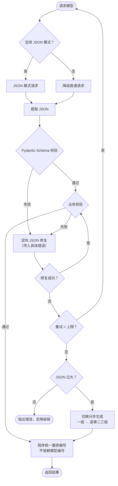

---

## 八、安全设计

### 图 8-1 中间件执行顺序与鉴权

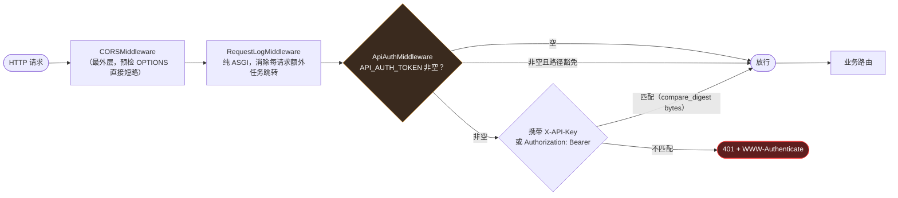

| 防线 | 措施 | 实现要点 |
| ---- | ---- | -------- |
| 访问控制 | 可选 API 鉴权 | `API_AUTH_TOKEN` 非空时所有 `/api/v1/*` 需 `X-API-Key` / `Bearer`；豁免 `/health`、`/docs`、`/redoc`、`/openapi.json`；`OPTIONS` 放行 |
| 时序侧信道 | 常数时间比较 | `secrets.compare_digest` 对 **bytes** 比较（str 形态遇非 ASCII 会抛 TypeError → 500） |
| 凭据安全 | API Key 加密存储 | Fernet（AES-256），`crypto.py` |
| 注入防护 | SQL 参数化 | 绑定参数，禁止 f-string 拼接 |
| 跨域控制 | CORS 可配置 | `cors_origins`（默认 `*` 开发态）；显式 `expose_headers`：`X-Chart-Render-Stats`/`X-Fix-Stats`/`X-Cache-Status`/`X-Export-Filename`/`X-Export-Round` |
| 上传安全 | 类型/大小限制 + 文件头校验 | 8 种格式；**逐条**压缩比判定 + 按实际读出字节设限（中央目录可伪造，不可只信声明元数据） |
| 畸形文件 | 主通道闸门 | PDF 主通道（PyMuPDF）打不开即 `ParseError`，不转交无闸门回退通道；能打开但无文字（扫描件）仍走 OCR/MinerU |
| 回退链路 | 异常分类 | `except ParseError: raise` 排在裸 `except Exception` 之前，避免安全闸门被吞成「解析成功但内容为空」 |
| 前端渲染 | XSS 消毒 | Markdown 渲染走 DOMPurify |

---

## 九、部署架构

### 图 9-1 部署拓扑图

```mermaid
flowchart LR
    U(["用户浏览器<br/>Chrome 120+ / Edge / Safari 17+"]) --> VITE["Vite Dev Server :5175<br/>（开发态，proxy 同源转发）"]
    VITE --> API["FastAPI 后端<br/>uvicorn :8000"]
    U --> NG["Nginx 反向代理<br/>（生产态，统一端口 80/443）"]
    NG --> DIST["前端静态资源<br/>frontend/dist"]
    NG --> API
    API --> DB[("SQLite<br/>backend/data/scheme_assistant.db")]
    API --> FS[("文件系统<br/>data/_exports/charts/<br/>data/uploads/facts/<br/>logs/")]
    API --> AIS["AI 供应商<br/>主配置 → 优先级候选 → Agnes 兜底"]
    API --> IMG["图像生成平台<br/>（可选，8 家）"]
    API --> MU["MinerU 云端<br/>（可选，扫描件兜底）"]
    BK["备份策略"] -.-> DB
    BK -.-> FS
    LG["loguru 日志轮转"] -.-> API
    subgraph DOCKER["Docker 部署（可选）"]
        DC["docker-compose up -d<br/>8000:8000 / 5175:80<br/>data 与 logs 卷持久化"]
    end
```

### 9.2 启动方式

```bash
# 一键启动（Windows）
start_all.bat          # 后端 watchdog 守护，崩溃自动重启；前端 Vite
# 手动启动
cd backend && uvicorn app.main:app --reload --host 0.0.0.0 --port 8000
cd frontend && npm run dev     # http://localhost:5175
```

### 9.3 启动自检（lifespan）

| 步骤 | 行为 |
| ---- | ---- |
| 数据库初始化 | `init_db()` 自动建表 |
| 鉴权状态声明 | `log_auth_configuration()`：未启用鉴权时输出告警 |
| 遗留任务清理 | `progress ≥ 0.95` 判已完成，其余标失败；「提取项目」中断解析项一并清理 |
| 并发应用 | `apply_config_concurrency()` 按活跃 AI 配置设置全局并发 |
| 可靠性预热 | `warmup_reliability_from_db()` 恢复最近 24h 成败统计，重启即剔除死配置 |
| 关闭收尾 | 冲刷 AI 审计缓冲（否则最后 ≤49 条静默丢失）→ 关闭 HTTP 连接池 → 关闭数据库 |

---

## 十、提示词资产架构

### 10.1 提示词分类

| 分类 | 文件 | 说明 |
| ---- | ---- | ---- |
| 目录生成 | `outline.py` | 一/二/三级目录生成；目录审核；修复；共享规则（`SHARED_*` 占位符运行时解析） |
| 正文生成 | `content.py` | 生成、续写（continue）、压缩（shrink）、**图表同步生成规范** |
| 图表 | `charts.py` | **仅保留 Mermaid 修复一条**（编排/生成已并入正文） |
| 配图 | `illustration.py` | `ILLUSTRATION_ARRANGE` / `ILLUSTRATION_PLAN` / `ILLUSTRATION_PROMPT_OPTIMIZE` |
| 分析 | `analysis.py` | 资料解析、全局事实提取、一致性审计、规范符合性、专家论证预检、查重、预检 |
| 一致性修复 | `consistency_repair.py` | 扫描 / 仲裁 / 修复三组 |
| 基础设施 | `_registry.py`、`_cache.py`、`_shared.py`、`_norm_dicts.py` | 注册表、DB 优先缓存、共享规则、事实归一化字典 |

### 10.2 提示词工程约定

1. **变量替换是正则替换，不是 `str.format()`**：JSON 示例里 `{...}` 无需转义；写 `{{` 会原样输出 `{{`。
2. **DB 优先、硬编码回退**：`get_prompt()` 先查 `prompt_templates`，缺失回退 `_ALL_PROMPTS`；保存后 `reload_prompt_cache()`。
3. **出厂基线不落库**：`default_content` 列全库无读取方，基线由 `get_default_prompt(key)` 常量持有；保存空内容 = 恢复默认（杜绝空提示词污染）。
4. **共享规则一处维护**：`outline.py` 的 `SHARED_*` 以占位符注入，前端编辑共享分类后立即对所有目录提示词生效（import 期字符串拼接会导致改了不生效）。
5. **同一图表类型在生成与修复提示词里必须教同一种数据结构**。
6. **提示词缓存分层**：`system` 只放稳定规则 → 大且稳定上下文前置 → 任务差异放最后 → 不放随机信息与时间戳。

---

## 十一、核心状态机图集

### 图 11-1 方案生命周期

```mermaid
stateDiagram-v2
    [*] --> 草稿 : 新建方案
    草稿 --> 目录生成中 : AI生成/目录库/标准目录/上传识别/混合
    目录生成中 --> 目录已确认 : 目录审核通过
    目录生成中 --> 草稿 : 生成失败
    目录已确认 --> 正文生成中 : 启动逐章生成
    正文生成中 --> 审核中 : 全部章节完成
    审核中 --> 已完成 : 审核通过
    审核中 --> 正文生成中 : 驳回重新生成
    已完成 --> 已归档 : 归档
    已归档 --> 已完成 : 取消归档
    note right of 审核中 : 方案状态与任务状态解耦<br/>不因任务在跑而被改写
```

### 图 11-2 章节状态

```mermaid
stateDiagram-v2
    [*] --> empty : 目录创建
    empty --> pending : 进入生成队列
    pending --> generated : AI 生成完成
    generated --> expanded : 字数不足续写
    expanded --> reviewed : 审核通过
    generated --> reviewed : 审核通过
    reviewed --> generated : 驳回重新生成
    generated --> pending : 重新生成
    generated --> over : 超出目标 130%
    over --> generated : 压缩（shrink，默认手动触发）
```

### 图 11-3 章节审核状态

```mermaid
stateDiagram-v2
    [*] --> pending : 章节创建
    pending --> reviewing : 提交审核
    reviewing --> approved : 通过
    reviewing --> rejected : 驳回（记录意见）
    rejected --> reviewing : 修改后重新提交
    approved --> reviewing : 复审
```

### 图 11-4 目录库审核状态

```mermaid
stateDiagram-v2
    [*] --> 待审核 : 手动/上传/AI/历史方案/内置模板入库
    待审核 --> 已通过 : 审核通过（可被公共调用）
    待审核 --> 已停用 : 直接停用
    已通过 --> 已停用 : 停用
    已停用 --> 已通过 : 重新启用
    已通过 --> 待审核 : 新版本提交
```

### 图 11-5 任务状态（Task Registry）

```mermaid
stateDiagram-v2
    [*] --> running : 注册任务（持久化至 SQLite）
    running --> paused : 用户暂停
    paused --> running : 恢复
    running --> stopped : 用户停止（cancel_tasks 统一取消子任务）
    running --> completed : 执行完成
    running --> failed : 异常终止
    failed --> running : 断点恢复（checkpoint_json）
    stopped --> running : 断点恢复
    running --> completed : 启动恢复：progress ≥ 0.95 判定已完成
    running --> failed : 启动恢复：其余标「服务重启，任务中断」
    completed --> [*]
    note right of running : SSE 多客户端订阅<br/>断线重连不丢进度
```

### 图 11-6 一致性修复状态

```mermaid
stateDiagram-v2
    [*] --> pending : 扫描 + 仲裁生成冲突项
    pending --> skipped : 无法确定权威值（不强行修复）
    pending --> fixing : 定向修复中
    fixing --> validating : repair_validator 二次校验
    validating --> fixing : 校验失败且未超重试
    validating --> failed : 仍失败（**不写库**）
    validating --> awaiting_confirm : 通过（已存快照，写入正文）
    awaiting_confirm --> accepted : 用户接受
    awaiting_confirm --> rejected : 用户拒绝（该章恢复快照原文）
    accepted --> [*]
    rejected --> [*]
    failed --> [*]
    note right of awaiting_confirm : 支持一键回滚<br/>只影响快照涉及章节
```

---

## 十二、测试策略

| 层 | 规模 | 覆盖重点 |
| -- | ---- | -------- |
| 后端 | 56 个测试文件（`backend/tests/`） | 目录/正文生成、进度模型、图表校验与渲染、文件解析硬化、全局事实持久化与解析、导出、Provider 工厂、任务控制语义、鉴权中间件、性能瓶颈 |
| 前端 | 7 个测试文件（`frontend/src/tests/`） | 凭据键名契约、SSE 流、mermaid 运行时、图表导出、事实 API、Markdown 渲染、工作流派生状态 |

**运行方式**（注意环境约束）：
```bash
# 后端
cd backend && python -m pytest --basetemp="$TEMP/pt_xxx"
# 前端
cd frontend && node node_modules/vitest/vitest.mjs run
cd frontend && node node_modules/typescript/bin/tsc --noEmit -p tsconfig.json
```

---

## 十三、版本历史

| 版本 | 日期 | 主要更新 |
| ---- | ---- | -------- |
| v2.0 | 2026-08-01 | 引入 AI 生成、图表渲染、导出缓存 |
| v3.0 | 2026-08-19 | Agent 多阶段工作流、全文一致性、智能问答、多格式解析 |
| v4.0 | 2026-09-10 | 版本修正、移除 Electron、Task Registry、七级标题规范、自适应并发精确参数、SSE 超时公式 |
| v5.0 | 2026-09-10 | 场景切换为专项方案编制；移除投标模块；新增项目下多方案、目录库、上传识别、全局事实 |
| v5.1 | 2026-09-10 | 对齐 PRD v5.1：专家论证预检；`compliance_check` 新增 `check_type` |
| v5.2 | 2026-09-10 | 全文 Mermaid 图表化升级（20 张图 + 图表索引 + 5 张状态机） |
| **v5.3** | **2026-09-18** | **架构回归代码**：基于全量扫描重建目录结构、模块依赖、数据流与状态机。新增/更正：正文与图表同步生成流水线、PIL v2 内置渲染 + 7 子模块、六维就绪度评分 + 程序化预检、一致性 Agent 修复闭环、文件解析多通道与闸门、MinerU 云端兜底、提取项目 18 项、24 平台 Provider + 对冲/降级/可靠性门限、http_pool 连接池、API 鉴权与中间件顺序、系统活动聚合、前端 7 路由 + 单页 8 区块、26 张表 ER、6 张新增状态机 |

---

## 十四、附录

### 14.1 关键参数速查

| 参数 | 值 | 位置 |
| ---- | -- | ---- |
| `APP_VERSION` | 5.3.0 | `config.py` |
| 全局 AI 并发上限 / 默认 | 5 / 3 | `max_concurrency` / `default_concurrency` |
| 自适应并发阈值 | 8s / 30s / 窗口 20 | `AdaptiveConcurrencyController` |
| 熔断阈值 / 冷却 | 2 次 / 5s | `AnalysisCircuitBreaker` |
| 对冲延迟 | 20s | `ai_hedge_delay_seconds` |
| 降级链上限 / 单次超时 | 3 / 120s | `ai_fallback_chain_max` / `ai_fallback_attempt_timeout` |
| 可靠性门限（后置/剔除） | 0.60 / 0.20 | `ai_provider_demote_success_rate` / `dead_success_rate` |
| SSE 总超时默认 / 硬上限 | 1800s / 14400s | `sse_total_timeout_*` |
| 单请求超时 | 900s | `ai_request_timeout` |
| AI 配置缓存 TTL | 300s | `ai_config_cache_ttl` |
| 六维权重 | 25/20/20/15/10/10 | `audit_rules.DIMENSIONS` |
| 提取项目维度 | 18（17 必选 + 1 可选） | `bid_analysis_service.ANALYSIS_ITEMS` |
| 提取切片 | 16000 字 / 重叠 500 | `DEFAULT_CHUNK_SIZE` / `OVERLAP` |
| 目录生成注入上限 | 事实 3000 / 知识 6000 / 原始摘录 4000 | `sse_handlers` |
| OCR | 页数上限 20 / DPI 200 / 每页 <30 字判扫描件 | `ocr_*` |
| MinerU | Agent 300s / 精准 600s / 轮询 3s | `mineru_*` |
| 图像生成 | 默认 2K / 并发 2 / 每项目 30 张 | `image_*` |
| 图表渲染 | 300 DPI，7 类 | `PIL_RENDERABLE_CHART_TYPES` |
| 导出缓存保留 | 最多 5 份 | `export.py` |

### 14.2 代码规模

| 项 | 规模 |
| -- | ---- |
| 后端 `app/` Python | 47,394 行 |
| 前端 `src/` TS-TSX | 19,211 行 |
| 后端路由模块 | 16 |
| 业务服务模块 | 31 |
| AI 基础设施模块 | 25 |
| 数据表 | 26 |
| 后端测试文件 | 56 |
| 前端测试文件 | 7 |
| AI 平台预设 | 24 |
| 图像平台适配器 | 8 |
| 标准目录模板 | 141（12 个一级分类） |

### 14.3 遗留与计划清理

| 项 | 状态 | 说明 |
| -- | ---- | ---- |
| `bid_section_detector.py` / 表 `bid_sections` | 未接线 | 标段检测，移植遗留，产品不启用 |
| `mermaid_service.py`（Docker/Railway/mmdc） | 可选 | PIL v2 已覆盖全部图表类型，外置后端仅作备选 |
| 智能问答独立页面 | 未落地 | 资料解析结果已可被目录/正文/事实消费 |
