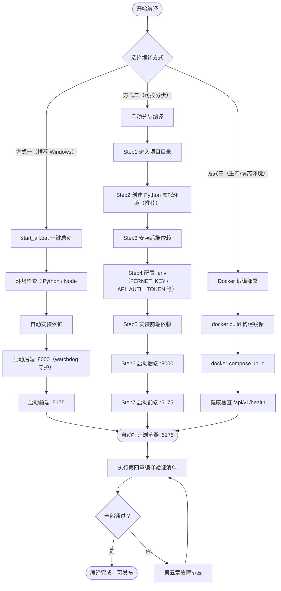
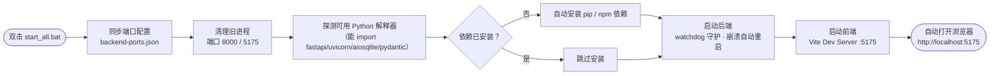
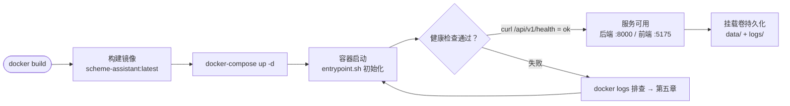
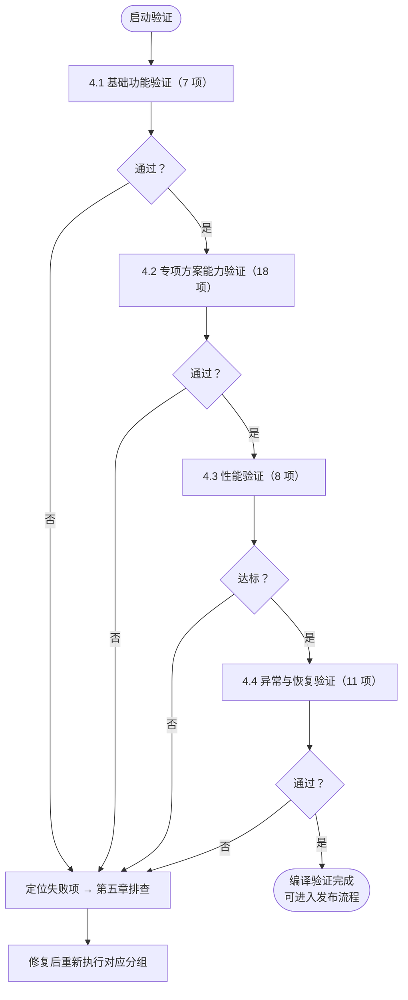
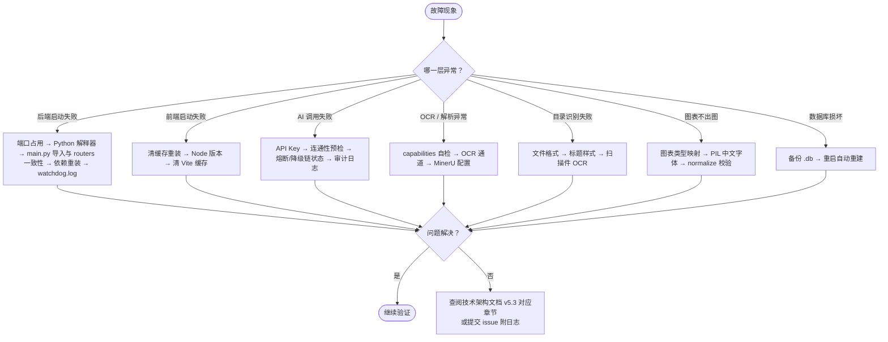
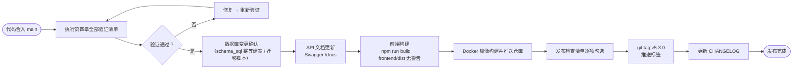

# 工程项目专项方案智能编制平台 — 软件编译计划书

**版本**：v5.3
**更新日期**：2026-09-18
**文档状态**：已发布
**对齐代码版本**：`APP_VERSION = 5.3.0` / `frontend/package.json` 5.3.0
**核心场景**：工程项目专项方案编制、目录生成与识别、正文编写、图表与计算书插入、审核与预检、导出 DOCX
---

## 〇、修订说明

### 0.1 本次编译计划核心变化：对齐真实可编译环境

v5.2 的依赖清单、目录结构、启动步骤与验证项基于 2026-09-10 的文档推演，**与当前代码已不一致**（典型：`requirements.txt` 实际是锁定版本而非 `>=`；前端无 Zustand / react-dropzone / jszip，改用了 React Router 7 / katex / dompurify；`routers/ai/`、`batch.py`、`monitoring.py`、`websocket.py` 等已移除）。本次全部按实际重写，并补齐 Windows 环境下**实测踩过的坑**。

| 类型 | 内容 |
| ---- | ---- |
| 依赖对齐 | Python 依赖改为 `requirements.txt` **锁定版本**（fastapi 0.139 / uvicorn 0.49 / PyMuPDF 1.27 / orjson 3.11 等）；前端依赖按实际 `package.json`（React 18.3 / antd 5.29 / React Router 7.18 / mermaid 11 / vitest 5） |
| 目录结构对齐 | 按实际 16 个路由模块 / 31 个业务服务 / 25 个 AI 基础设施模块重写 |
| 新增编译项 | MinerU 云端解析（可选）、OCR 三通道、可选 API 鉴权（`API_AUTH_TOKEN`）、Fernet Key 生成 |
| 新增验证项 | 程序化预检、六维就绪度评分、一致性 Agent 修复闭环（扫描/仲裁/修复/确认/回滚）、提取项目 18 项、图表正文一体生成与 PIL v2 渲染、系统活动状态栏 |
| 移除 | Electron 桌面应用、投标相关编译步骤与验证项、不存在的模块验证（如 `duplicate.py`、`project_documents.py` 独立路由） |
| 环境铁律 | 新增「Windows 环境实测铁律」章节（Python 解释器选择、`.bat` 编码、pytest basetemp、端口与进程管理） |

### 0.2 明确不包含
招标文件解析、技术评分对齐、废标项检查、投标响应、商务/报价/资格文件、评标办法匹配等投标相关编译步骤与验证项。
> `bid_analysis*` 模块与表虽沿用历史命名，实际职责是**项目资料结构化提取（18 项维度）**，属本计划验证范围。

---

## 一、编译环境要求

### 1.1 系统要求

| 组件 | 最低版本 | 推荐版本 | 说明 |
| ---- | -------- | -------- | ---- |
| OS | Windows 10 / macOS 12 / Ubuntu 20.04 | Windows 11 / macOS 15 / Ubuntu 24.04 | 支持主流桌面系统 |
| RAM | 8 GB | 16 GB+ | 多章节并发生成与 PIL 渲染占用较高 |
| Disk | 2 GB 可用 | 10 GB+ | 含依赖、缓存、导出文件 |
| Network | 稳定互联网 | 10 Mbps+ | AI API 调用需要低延迟 |

### 1.2 必需软件

| 软件 | 版本要求 | 用途 |
| ---- | -------- | ---- |
| Python | **3.10+（实测 3.13 / 3.14）** | 后端运行时 |
| Node.js | 20.0.0+（构建环境建议 22 LTS） | 前端构建 |
| npm / pnpm | latest | 包管理器 |
| Git | 2.30+ | 版本控制 |

### 1.3 可选软件

| 软件 | 用途 | 不装时的行为 |
| ---- | ---- | ------------ |
| Tesseract OCR 5.4+（含 `chi_sim`） | 本地 OCR 通道 1 | 自动降级到 RapidOCR / 视觉大模型 |
| **RapidOCR**（`pip install rapidocr-onnxruntime`） | 本地 OCR 通道 2（Windows 零配置推荐） | 走其他通道 |
| Microsoft Word / LibreOffice | 导出 PDF（DOCX → PDF） | PDF 导出不可用，DOCX 正常 |
| Docker Desktop | 容器化部署 | 不影响本地编译 |
| Redis | 可选缓存加速 | 不启用 |

> **OCR 说明**：旧版把 Tesseract 列为必需。当前 `ocr.py` 提供三条互相独立的通道（tesseract → RapidOCR → 视觉大模型），**任一条可用即可工作**；`ocr_engine` 可设为 `auto` / `tesseract` / `rapidocr` / `vision` / `off`。
> **Mermaid 说明**：`mmdc` CLI 已不再需要，内置 PIL v2 渲染器覆盖全部 7 类图表。

### 1.4 环境自检命令

```bash
python --version          # 应 ≥ 3.10
node --version            # 应 ≥ 20.0.0
git --version             # 应 ≥ 2.30
# 可选：OCR
tesseract --version       # 应 ≥ 5.4（若安装）
tesseract --list-langs    # 应包含 chi_sim
# 启动后端后自检能力矩阵
curl http://localhost:8000/api/v1/diagnostics/capabilities
# 返回 ocr / mermaid / parsers 三类可用性，用于定位「扫描件无法提取」「导出无图」
```

---

## 二、项目结构概览（实际）

```text
专项方案工具箱/
├── backend/
│   ├── app/
│   │   ├── main.py / config.py / db.py / models.py / middleware.py
│   │   ├── schema_sql.py（26 张表） / seed_data.py（141 个标准目录模板）
│   │   ├── routers/            # 16 个
│   │   │   ├── sse_handlers.py ★ 核心（4059 行）
│   │   │   ├── export.py ★（2760 行） / global_facts.py（1490 行）
│   │   │   ├── ai_config.py（1301 行） / bid_analysis.py（1027 行）
│   │   │   ├── compliance.py（638 行） / outline_library.py（635 行）
│   │   │   ├── sections.py（582 行） / charts.py（593 行）
│   │   │   ├── _chart_pipeline.py / consistency_repair.py / review.py
│   │   │   ├── upload_outline.py / schemes.py / projects.py
│   │   │   ├── knowledge.py / scheme_catalog.py / system.py
│   │   ├── services/           # 31 个
│   │   │   ├── file_parser.py（1269 行） / facts_extractor.py（2141 行）
│   │   │   ├── outline_templates.py（2407 行） / chart_validators.py（1829 行）
│   │   │   ├── preflight_engine.py / audit_rules.py / audit_scoring.py
│   │   │   ├── consistency_scanner.py / conflict_arbiter.py / repair_*.py
│   │   │   ├── content_polish.py / content_shrink.py / docx_math.py
│   │   │   ├── ocr.py / mineru_client.py / standards_registry.py
│   │   │   └── outline_reorganize.py / outline_reference.py / outline_utils.py
│   │   └── services/ai/        # 25 个
│   │       ├── provider_factory.py（1417 行，24 平台）
│   │       ├── mermaid_renderer.py + 7 个子渲染器 + mermaid_common
│   │       ├── image_engine.py + image_providers/（8 家）
│   │       ├── prompts/（_registry / _cache / _shared / _norm_dicts
│   │       │            outline / content / charts / analysis
│   │       │            consistency_repair / illustration）
│   │       ├── json_response.py / task_registry.py / workflows_base.py
│   │       ├── heading_templates / heading_v1 / heading_v2 / heading_standard
│   │       ├── http_pool.py / sse_utils.py / mermaid_service.py
│   │       └── providers/（base / openai_compatible / anthropic_compatible）
│   ├── requirements.txt        # 锁定版本
│   └── tests/                  # 56 个测试文件
├── frontend/
│   ├── src/                    # 19,211 行
│   │   ├── App.tsx（7 条路由） / api/index.ts / types/audit.ts
│   │   ├── hooks/useSchemeLiveTask.ts
│   │   ├── utils/（activityCenter / exportCharts / theme / ui / workflowDerived）
│   │   ├── components/（Layout / TaskStatusBar / ActivityHint /
│   │   │                MarkdownRenderer / SectionContentCard /
│   │   │                OutlineLibraryEditModal / mermaidRuntime /
│   │   │                review/ReviewWorkflowPanel / review/ReadinessDashboard）
│   │   ├── pages/（ProjectList / ProjectDetail / SchemeWorkbench ★8479 行 /
│   │   │           OutlineLibrary / AIConfig / PromptEditor / SecuritySettings）
│   │   └── tests/              # 7 个测试文件
│   ├── package.json（5.3.0）
│   └── vite.config.ts（端口 5175）
├── start_all.bat               # Windows 一键启动
├── start_all.sh                # macOS/Linux 一键启动
├── logs/                       # watchdog.log / backend_crash_log.txt
└── 产品需求文档.MD / 技术架构文档.MD / 软件编译计划书.MD
```

---

## 三、编译步骤

### 图 3-0 编译流程总览



### 3.1 方式一：一键启动（Windows 推荐）

```batch
@echo off
REM 双击运行或命令行执行
start_all.bat
```

**图 3-1 一键启动脚本流程**



**输出日志位置**：
- 后端日志：`logs/watchdog.log`
- 崩溃日志：`logs/backend_crash_log.txt`

### 3.2 方式二：手动分步编译

#### Step 1：进入项目目录

```bash
cd /path/to/专项方案工具箱
```

#### Step 2：准备 Python 环境

```bash
cd backend
python -m venv .venv
# Windows
.venv\Scripts\activate
# macOS/Linux
source .venv/bin/activate
```

> **Windows 铁律**：PATH 上第一个 `python` **不一定是项目解释器**（WorkBuddy 托管 Python 可能排在前面且缺少项目依赖）。
> 一键脚本必须**自动探测**能 `import fastapi,uvicorn,aiosqlite,pydantic` 的解释器，不要写死 `python`。

#### Step 3：安装后端依赖

```bash
pip install -r requirements.txt
```

**核心依赖（锁定版本，摘自 `requirements.txt`）**：

| 分类 | 包 |
| ---- | -- |
| Web 框架 | `fastapi==0.139.0`、`uvicorn[standard]==0.49.0`、`starlette==1.3.1`、`sse-starlette==3.4.4`、`python-multipart==0.0.32` |
| 数据校验 & 配置 | `pydantic==2.13.4`、`pydantic-settings==2.14.1`、`python-dotenv==1.2.2` |
| 数据库 | `aiosqlite==0.22.1` |
| HTTP & SSE | `httpx==0.28.1`、`httpx-sse==0.4.3`、`aiohttp==3.14.1` |
| 加密 | `cryptography==48.0.1`、`pyjwt==2.13.0` |
| 文档解析 | `python-docx==1.2.0`、`docx2python==3.6.2`、`pdfplumber==0.11.9`、`pypdf==6.14.2`、`pymupdf==1.27.2.3`、`openpyxl==3.1.5`、`xlrd==2.0.1`、`python-dateutil` |
| 图表渲染 | `pillow==12.2.0`、`lxml==6.1.1`、`orjson==3.11.9` |
| OCR（可选） | `pytesseract==0.3.13`（RapidOCR 需额外 `pip install rapidocr-onnxruntime`） |
| 日志 | `loguru==0.7.3`、`rich==15.0.0` |

#### Step 4：配置环境变量（`backend/.env`）

```bash
cat > backend/.env << 'EOF'
# ---- 必配 ----
FERNET_KEY=<32 字节 Base64，见下方生成命令>

# ---- 可选：安全 ----
# 为空 = 关闭鉴权（本地单机默认）；非空 = 所有 /api/v1/* 需 X-API-Key 或 Bearer
API_AUTH_TOKEN=
CORS_ORIGINS=*

# ---- 可选：数据库 ----
DATABASE_URL=sqlite+aiosqlite:///./data/scheme_assistant.db

# ---- 可选：OCR ----
OCR_ENABLED=true
OCR_ENGINE=auto            # auto | tesseract | rapidocr | vision | off
OCR_LANG=chi_sim+eng
TESSERACT_PATH=            # 留空自动检测
TESSERACT_DATA_PATH=

# ---- 可选：MinerU 云端解析（扫描件兜底）----
MINERU_PROVIDER=           # 留空关闭；agent | accurate
MINERU_TOKEN=
MINERU_ENABLED=true

# ---- 可选：内置兜底供应商 ----
AGNES_API_KEY=
AGNES_BASE_URL=https://api.agnes-ai.cn/v1
AGNES_MODEL=agnes-2.5-flash

# ---- 可选：AI 生图 ----
IMAGE_PROVIDER=agnes       # agnes | dashscope | volcengine | hunyuan | zhipu | stepfun | baidu
IMAGE_ENABLED=true
IMAGE_DEFAULT_SIZE=2K
IMAGE_MAX_CONCURRENCY=2
IMAGE_MAX_PER_PROJECT=30

# ---- 可选：代理 ----
PROXY_HOST=
PROXY_PORT=
EOF

# 生成 Fernet Key（仅首次）
python -c "from cryptography.fernet import Fernet; print(Fernet.generate_key().decode())"
```

#### Step 5：安装前端依赖

```bash
cd ../frontend
npm install          # 或 pnpm install
```

**前端依赖（摘自 `package.json` v5.3.0）**：

| 类型 | 包 |
| ---- | -- |
| dependencies | `react/react-dom ^18.3.0`、`antd ^5.29.3`、`@ant-design/icons ^5.6.0`、`axios ^1.12.0`、`react-router-dom ^7.18.3`、`mermaid ^11.0.0`、`marked ^14.0.0`、`katex ^0.18.7`、`dompurify ^3.4.15` |
| devDependencies | `vite ^6.0.0`、`@vitejs/plugin-react ^4.7.0`、`typescript ^5.9.0`、`vitest ^5.0.0`、`jsdom ^30.0.1`、`@testing-library/react ^16.3.3`、`@types/react ^18.3.0` |

> **版本修正说明**：v5.0 文档曾写 `zustand` / `react-dropzone` / `file-saver` / `jszip`，实际 `package.json` 中**均无**；状态管理采用 React hooks + `useSchemeLiveTask`。请勿按旧文档安装。

#### Step 6：启动后端

```bash
cd ../backend
uvicorn app.main:app --reload --host 0.0.0.0 --port 8000
```

**启动自检（lifespan 会依次执行并在日志中体现）**：
1. `init_db()` 自动建表（26 张）
2. `log_auth_configuration()`：未启用鉴权时输出告警
3. 遗留任务清理：`progress ≥ 0.95` 判已完成，其余标失败；「提取项目」中断解析项一并清理
4. `apply_config_concurrency()`：按活跃 AI 配置设置全局并发
5. `warmup_reliability_from_db()`：恢复最近 24h Provider 成败统计

**验证后端**：

```bash
curl http://localhost:8000/api/v1/health
# 预期: {"status":"ok","version":"5.3.0"}

curl http://localhost:8000/api/v1/diagnostics/capabilities
# 预期: 返回 ocr / mermaid / parsers 三类可用性矩阵

curl http://localhost:8000/api/v1/compliance/expert-review/items
# 预期: 返回 10 项论证预检清单
```

#### Step 7：启动前端

```bash
cd ../frontend
npm run dev      # vite --port 5175 --host
```

访问 `http://localhost:5175`。

### 3.3 方式三：Docker 编译部署

**图 3-3 Docker 部署流程**



```bash
docker build -t scheme-assistant:latest .
docker-compose up -d
docker ps
docker logs -f scheme-assistant-app
curl http://localhost:8000/api/v1/health
```

| 服务 | 端口 | 说明 |
| ---- | ---- | ---- |
| 后端 API | 8000 | FastAPI / Swagger `/docs` |
| 前端 | 5175 | Vite Dev Server / Nginx |

---

## 四、编译验证清单

### 图 4-0 验证执行流程



### 4.1 基础功能验证

| # | 测试项 | 操作步骤 | 预期结果 |
| - | ------ | -------- | -------- |
| 1 | 项目创建 | 项目列表「新建项目」 | 项目出现在列表 |
| 2 | 方案创建 | 项目详情「新建方案」（可选用方案清单标准目录） | 方案出现在项目下 |
| 3 | 目录生成 | 工作台「目录生成」 | SSE 进度条推进，章节树更新，编号程序统一 |
| 4 | 正文生成 | 「正文生成」 | 各章节逐步填充，图表随正文内嵌产出 |
| 5 | 图表渲染 | 正文生成完成后 | 图表在预览区渲染（mermaid.js），导出时由 PIL v2 出图 |
| 6 | DOCX 导出 | 「导出文档」 | 文件下载成功，封面/目录/页码按预设生效 |
| 7 | AI 切换 | 修改 AI 配置并预检 | 下次生成使用新供应商；预检返回连通性 |

### 4.2 专项方案能力验证

| # | 测试项 | 操作步骤 | 预期结果 |
| - | ------ | -------- | -------- |
| 1 | 文件导入 | 上传 DOCX/PDF/XLSX/图片等 | 文件进入列表，显示解析状态 |
| 2 | 文件解析 | 执行解析 | `parsed_markdown` 生成；截断有提示 |
| 3 | 重新解析 | 对已解析文档点「重新解析」 | 补齐旧版截断内容 / 启用 OCR 后重扫扫描件 |
| 4 | 扫描件解析 | 上传扫描版 PDF | 走 OCR 或 MinerU 云端，产出文本（三通道任一可用即可） |
| 5 | 提取项目 | 「提取项目」执行 18 项 | 并发提取，进度可见；17 必选项齐备 |
| 6 | 结构化成果消费 | 提取后生成目录 | 目录引用结构化摘要，而非仅原始前 4000 字 |
| 7 | 全局事实提取 | 「全局事实」生成 | 分组展示，模拟值/冲突有标记 |
| 8 | 模拟值策略 | 切换「智能补全 / 不杜撰 / 留待填写」 | 对应标记、【待填写】或剔除 |
| 9 | 事实人工裁决 | 对冲突事实裁决 | 冲突解除，导出缓存被清空 |
| 10 | 上传目录识别 | 上传带标题样式文件识别 | 树形目录 + 置信度标注，< 0.7 高亮 |
| 11 | 导入目录整理 | 识别后保存 | 补齐编写要点，对齐危大法定章节，统一为三级 |
| 12 | 目录库调用 | 新建方案选目录库模板 | 目录按模板生成 |
| 13 | 目录库版本 | 新建版本 / 回滚 | 版本历史可切换 |
| 14 | 目录库审核 | 提交审核 / 批量审核 | 通过后可被公共调用 |
| 15 | 字数压缩 | 对超字数章节点「压缩本章」 | 只删不改，表格/图表/代码块/图片/技术参数受保护 |
| 16 | 程序化预检 | 执行预检 | 秒级返回六组发现项（CMP/STD/SAF/CON/TRC/DEL） |
| 17 | 六维就绪度评分 | 查看评分 | 六维得分 + 加权总分 + 阻断项 + 放行/整改结论 |
| 18 | 一致性 Agent 修复 | 扫描 → 修复 → 确认/拒绝 → 回滚 | 冲突定级、权威值仲裁、快照可回滚；拒绝后该章恢复原文 |

### 4.3 性能验证

| # | 指标 | 测试方法 | 合格标准 |
| - | ---- | -------- | -------- |
| 1 | API 响应 | `curl -w` 测量 | < 200ms |
| 2 | 目录生成 | 计时 8 章生成 | < 5 分钟 |
| 3 | 正文生成 | 计时 20 章生成 | < 30 分钟 |
| 4 | 导出性能 | 导出 100 页 DOCX | < 30 秒 |
| 5 | 程序化预检 | 完整方案预检 | 秒级（离线，无 AI 调用） |
| 6 | 六维评分 / 论证预检 | 危大工程完整方案 | < 30 秒 |
| 7 | 全文一致性扫描 | 完整方案 | < 60 秒 |
| 8 | 图表渲染 | 单张 PIL v2 渲染 | < 5 秒 |

### 4.4 异常与恢复验证

| # | 场景 | 操作 | 预期结果 |
| - | ---- | ---- | -------- |
| 1 | AI 超时 | 断开网络后生成 | 对冲请求 + 降级链切换到其他供应商 |
| 2 | 死配置 | 配置错误 API Key | 成功率低于门限 → 后置/剔除；熔断触发并提示 |
| 3 | 服务熔断 | 连续 2 次 AI 失败 | `AnalysisCircuitBreaker` 熔断，冷却 5s 后探测 |
| 4 | 并发过载 | 同时生成多章节 | 自适应并发降速；全局上限 5 生效；连续 429 触发限流降速 |
| 5 | 数据库错误 | 删除 `data/` 目录后启动 | 自动重建数据库（26 张表） |
| 6 | 前端刷新 | 刷新页面 | 任务状态从后端聚合恢复，进度不丢 |
| 7 | 后端崩溃 | 杀死进程 | watchdog 自动重启 |
| 8 | 任务中断恢复 | 正文生成中重启后端 | Task Registry 断点恢复；遗留任务按 progress 分级处理 |
| 9 | 畸形 PDF | 上传畸形/炸弹 PDF | 主通道打不开即报错，**不转交无闸门回退通道** |
| 10 | 目录识别失败 | 上传无标题样式文件 | 提示人工校正，提供基础层级 |
| 11 | 鉴权生效 | 设置 `API_AUTH_TOKEN` 后不带凭据请求 | 返回 401 + `WWW-Authenticate`；`OPTIONS` 预检不受影响 |

---

## 五、常见问题排查

### 图 5-0 故障排查决策树



### 5.1 后端启动失败

```bash
# 1) 查端口占用
netstat -ano | grep LISTENING | grep -E ":8000|:5175"

# 2) 查 Python 解释器（务必确认能 import 项目依赖）
python -c "import fastapi, uvicorn, aiosqlite, pydantic; print('ok')"

# 3) 重装依赖
pip install -r requirements.txt --force-reinstall

# 4) 看日志
cat logs/watchdog.log
cat logs/backend_crash_log.txt
```

> ⚠️ **高频坑**：`app/main.py` 的 `from app.routers import (...)` 必须与 `app/routers/` 下**实际存在的 `.py` 文件**一致。
> 历史事故：某路由源码已删除但 `main.py` 仍导入它 → 只要重启就 `ImportError`，而旧进程是删文件前启动的，表面「一直好好的」。
> **排查线索**：`app/routers/__pycache__/` 里有 `.pyc` 但目录里没有对应 `.py`。

### 5.2 前端启动失败

```bash
cd frontend
rm -rf node_modules .vite      # 注意：工作区内 rm -rf 可能被安全守卫拦截，见 5.7
npm install
node --version                 # 应 ≥ 20
```

### 5.3 AI 调用失败

```bash
# 连通性预检（推荐，替代手工 curl）
curl -X POST http://localhost:8000/api/v1/ai/config/precheck-all

# 查看审计日志与统计
curl http://localhost:8000/api/v1/ai/stats
curl http://localhost:8000/api/v1/ai/audit-logs

# 能力矩阵（确认 parsers / ocr / mermaid）
curl http://localhost:8000/api/v1/diagnostics/capabilities
```

### 5.4 OCR / 解析异常

```bash
# 先看能力自检
curl http://localhost:8000/api/v1/diagnostics/capabilities

# 检查本机 tesseract
where tesseract && tesseract --version && tesseract --list-langs | grep chi

# 无 tesseract 时：切 RapidOCR（纯 pip，Windows 零配置）
pip install rapidocr-onnxruntime
# 并在 backend/.env 设置 OCR_ENGINE=rapidocr
```

### 5.5 图表不出图

| 现象 | 排查 |
| ---- | ---- |
| 预览有图、导出无图 | 检查 `MERMAID_KEYWORD_TO_CHART_TYPE` 是否覆盖该关键字（登记侧与导出侧必须同一映射） |
| 图表被整块删除 | 校验器与渲染器是否走同一个 `normalize_*`（`chart_validators.py`） |
| 导出红字占位 | 校验通过但渲染返回 None —— 检查该类型是否在 `PIL_RENDERABLE_CHART_TYPES` 中 |
| 中文乱码 | PIL 中文字体探测失败，检查系统是否有 Noto CJK / 文泉驿 / PingFang / 宋体 |

### 5.6 数据库损坏

```bash
mv backend/data/scheme_assistant.db backend/data/scheme_assistant.db.bak
# 重新启动后端，会自动创建新库（26 张表）
```

### 5.7 Windows 环境实测铁律（重要）

| # | 铁律 | 后果（违反时） |
| - | ---- | -------------- |
| 1 | **`.bat` 必须 GBK(CP936) + CRLF + 无 BOM，且脚本内绝不执行 `chcp`** | cmd.exe 按字节偏移逐段读 bat；中途 `chcp` 会让字符数/字节数换算错位 → 从半截中文处当命令执行 → 脚本闪退（实测退出码 255）。UTF-8 BOM 还会让首行 `@echo off` 失效 |
| 2 | **`timeout` 要用 `%SystemRoot%\System32\timeout.exe`** | PortableGit 的 GNU `timeout` 在 PATH 中排在 `System32` 前，`timeout /t 1` 报 `invalid time interval`（退出码 125） |
| 3 | **杀进程写 `MSYS_NO_PATHCONV=1 taskkill /PID <pid> /T /F`** | MSYS 会把 `/PID` 转义成 `//PID` →「无效参数」。查进程用 `tasklist /FI "PID eq <pid>"`（`wmic` 不可用） |
| 4 | **`uvicorn --reload` 会 fork reloader 父进程持有监听套接字** | `taskkill /T` 只杀子树；必要时按 `netstat` 里的 PID 再清一次 |
| 5 | **pytest 必须带 `--basetemp="$TEMP/pt_xxx"`** | 工作区路径不豁免删除守卫 → 累计删除超阈值（50）会 `SystemExit(1)` 杀掉 pytest，表现为「一批测试报错、单跑全绿」的顺序效应假失败。`--basetemp` 必须用 `$TEMP` 的**字面量/8.3 短名**前缀，写长名会导致豁免失效 |
| 6 | **不要在工作区内 `rm -rf` 目录** | 同样触发删除守卫，且会让 `A && pytest` 整条命令短路（pytest 根本没跑，你看到的却是上一次的旧输出文件） |
| 7 | **同一消息内不要对同一文件发起多次编辑** | 编辑工具是「读→改→写回」，并发会互相覆盖、后写的赢，先写改动静默丢失（仍返回成功）。必须逐条串行提交 |
| 8 | **改完必须复核** | 后端 `python -m py_compile`；前端 `node node_modules/typescript/bin/tsc --noEmit -p tsconfig.json` |

### 5.8 测试执行

```bash
# 后端（务必带 basetemp）
cd backend
python -m pytest --basetemp="$TEMP/pt_xxx" -q

# 前端单测
cd frontend
node node_modules/vitest/vitest.mjs run
# ⚠️ 不要加 --reporter=basic，会 ERR_LOAD_URL

# 前端类型检查
node node_modules/typescript/bin/tsc --noEmit -p tsconfig.json
```

---

## 六、发布流程

### 图 6-1 发布流水线



### 6.2 版本管理

```bash
# 版本号规范: MAJOR.MINOR.PATCH
git tag v5.3.0
git push origin v5.3.0
git commit -m "chore: release v5.3.0" CHANGELOG.md
```

> 版本号唯一来源：`backend/app/config.py` 的 `APP_VERSION`（同时被 `/api/v1/health` 与 FastAPI `version` 消费）；前端 `frontend/package.json` 的 `version` 应与之同步。

### 6.3 构建产物

| 产物 | 路径 | 说明 |
| ---- | ---- | ---- |
| 后端代码 | `backend/` | Python 源码 |
| 前端构建 | `frontend/dist/` | 静态文件 |
| Docker 镜像 | `scheme-assistant:latest` | 完整容器 |
| 文档 | `产品需求文档.MD` / `技术架构文档.MD` / `软件编译计划书.MD` | v5.3 |

### 6.4 发布检查清单

- [ ] 第四章全部验证清单通过
- [ ] 前端类型检查 `tsc --noEmit` 无错误
- [ ] 前后端测试通过（后端 56 文件 / 前端 7 文件）
- [ ] `APP_VERSION` 与前端 `package.json` 版本号已同步
- [ ] API 文档已更新（Swagger `/docs`）
- [ ] 前端构建无警告
- [ ] Docker 镜像推送至仓库
- [ ] 能力自检 `/diagnostics/capabilities` 中 OCR / 图表 / 解析器状态符合目标环境预期
- [ ] 文件解析（含扫描件）功能验证通过
- [ ] 提取项目 18 项功能验证通过
- [ ] 全局事实（含模拟值策略与人工裁决）验证通过
- [ ] 上传目录识别与导入整理验证通过
- [ ] 专项方案目录库（版本 + 审核 + 调用）验证通过
- [ ] 程序化预检与六维就绪度评分验证通过
- [ ] 专家论证预检验证通过（危大工程方案）
- [ ] 一致性 Agent 修复闭环（含回滚）验证通过
- [ ] DOCX / PDF 导出验证通过（含公式 OMML、导出缓存）
- [ ] 可选 API 鉴权验证通过（`API_AUTH_TOKEN` 非空时 401 行为正确）
- [ ] 确认无投标相关模块/路由/提示词残留（`grep -ri "废标\|评分点\|偏离表\|资格标"` 应无业务命中）
- [ ] 版本标签已打

---

## 七、开发规范

### 7.1 代码风格
- **Python**：遵循 PEP 8；复杂逻辑必须有中文 docstring 说明「为什么这么做」
- **TypeScript**：严格模式（`strict: true`）
- **提交规范**：Conventional Commits（`feat:` / `fix:` / `docs:` / `refactor:` / `test:` / `perf:`）

### 7.2 分支策略

```text
main
├── develop
│   ├── feat/outline-library        专项方案目录库
│   ├── feat/upload-outline         上传目录识别与导入整理
│   ├── feat/global-facts           全局事实变量
│   ├── feat/compliance-check       规范符合性 + 专家论证预检
│   ├── feat/preflight-scoring      程序化预检 + 六维就绪度评分
│   ├── feat/consistency-repair     一致性 Agent 修复闭环
│   ├── feat/file-parser            多格式解析 + OCR/MinerU 兜底
│   ├── feat/api-auth               可选 API 鉴权
│   └── perf/ai-call-chain          连接池 / 对冲 / 可靠性降级
```

### 7.3 环境变量

| 变量名 | 说明 | 默认值 |
| ------ | ---- | ------ |
| `DATABASE_URL` | 数据库连接串 | `sqlite+aiosqlite:///./data/scheme_assistant.db` |
| `FERNET_KEY` | API Key 加密密钥 | 必填（32 字节 Base64） |
| `API_AUTH_TOKEN` | API 鉴权令牌 | 空 = 关闭鉴权 |
| `CORS_ORIGINS` | CORS 白名单 | `*` |
| `OCR_ENABLED` / `OCR_ENGINE` / `OCR_LANG` | OCR 开关 / 引擎 / 语言 | `true` / `auto` / `chi_sim+eng` |
| `OCR_PDF_MAX_PAGES` / `OCR_PDF_DPI` / `OCR_MIN_CHARS_PER_PAGE` | OCR 页数上限 / DPI / 扫描件判定 | 20 / 200 / 30 |
| `TESSERACT_PATH` / `TESSERACT_DATA_PATH` | Tesseract 路径 | 自动检测 |
| `MINERU_PROVIDER` / `MINERU_TOKEN` / `MINERU_ENABLED` | MinerU 云端 | 空（关闭）/ 空 / true |
| `MINERU_AGENT_TIMEOUT` / `MINERU_ACCURATE_TIMEOUT` / `MINERU_POLL_INTERVAL` | MinerU 超时与轮询 | 300 / 600 / 3.0 |
| `AGNES_API_KEY` / `AGNES_BASE_URL` / `AGNES_MODEL` | 内置兜底供应商 | 空 / `https://api.agnes-ai.cn/v1` / `agnes-2.5-flash` |
| `IMAGE_PROVIDER` / `IMAGE_MODEL` / `IMAGE_ENABLED` / `IMAGE_DEFAULT_SIZE` / `IMAGE_MAX_CONCURRENCY` / `IMAGE_MAX_PER_PROJECT` | AI 生图 | `agnes` / 空 / true / `2K` / 2 / 30 |
| `MERMAID_SERVICE_URL` / `MERMAID_RAILWAY_URL` | 可选外置 Mermaid 渲染 | 空（用内置 PIL v2） |
| `MAX_CONCURRENCY` / `DEFAULT_CONCURRENCY` | 全局 AI 并发上限 / 默认 | 5 / 3 |
| `AI_HEDGE_ENABLED` / `AI_HEDGE_DELAY_SECONDS` | 对冲请求 | true / 20.0 |
| `AI_FALLBACK_CHAIN_MAX` / `AI_FALLBACK_ATTEMPT_TIMEOUT` | 降级链 | 3 / 120 |
| `AI_PROVIDER_DEMOTE_SUCCESS_RATE` / `AI_PROVIDER_DEAD_SUCCESS_RATE` | 可靠性门限 | 0.60 / 0.20 |
| `AI_REQUEST_TIMEOUT` / `SSE_TOTAL_TIMEOUT_DEFAULT` / `SSE_TOTAL_TIMEOUT_HARD_MAX` | 超时 | 900 / 1800 / 14400 |
| `AI_CONFIG_CACHE_TTL` | 配置缓存（秒） | 300 |
| `PROXY_HOST` / `PROXY_PORT` | HTTP 代理 | 空 |

---

## 八、附录：依赖版本锁定

### 8.1 Python 依赖（`backend/requirements.txt`）

```text
# --- Web 框架 ---
fastapi==0.139.0
uvicorn[standard]==0.49.0
python-multipart==0.0.32
starlette==1.3.1
sse-starlette==3.4.4

# --- 数据校验 & 配置 ---
pydantic==2.13.4
pydantic-settings==2.14.1
python-dotenv==1.2.2

# --- 数据库 ---
aiosqlite==0.22.1

# --- HTTP & SSE ---
httpx==0.28.1
httpx-sse==0.4.3
aiohttp==3.14.1

# --- 加密 ---
cryptography==48.0.1
pyjwt==2.13.0

# --- 文档解析 ---
python-docx==1.2.0
docx2python==3.6.2
pdfplumber==0.11.9
pypdf==6.14.2
pymupdf==1.27.2.3
openpyxl==3.1.5
xlrd==2.0.1
python-dateutil==2.9.0.post0

# --- 图表渲染 ---
pillow==12.2.0
lxml==6.1.1
orjson==3.11.9

# --- 图像处理（可选：扫描件识别） ---
pytesseract==0.3.13

# --- 日志 ---
loguru==0.7.3
rich==15.0.0
```

> 可选附加：`rapidocr-onnxruntime`（OCR 通道 2，Windows 零配置推荐）。

### 8.2 Node.js 依赖（`frontend/package.json` v5.3.0）

```json
{
  "dependencies": {
    "@ant-design/icons": "^5.6.0",
    "@types/katex": "^0.16.8",
    "antd": "^5.29.3",
    "axios": "^1.12.0",
    "dompurify": "^3.4.15",
    "katex": "^0.18.7",
    "marked": "^14.0.0",
    "mermaid": "^11.0.0",
    "react": "^18.3.0",
    "react-dom": "^18.3.0",
    "react-router-dom": "^7.18.3"
  },
  "devDependencies": {
    "@testing-library/dom": "^10.4.1",
    "@testing-library/react": "^16.3.3",
    "@types/react": "^18.3.0",
    "@types/react-dom": "^18.3.0",
    "@vitejs/plugin-react": "^4.7.0",
    "jsdom": "^30.0.1",
    "typescript": "^5.9.0",
    "vite": "^6.0.0",
    "vitest": "^5.0.0"
  },
  "scripts": {
    "dev": "vite --port 5175 --host",
    "build": "tsc && vite build",
    "preview": "vite preview --port 5175",
    "test": "vitest run"
  }
}
```

> **版本修正说明**：v5.0 文档中的 `zustand` / `react-dropzone` / `file-saver` / `jszip` / `react-markdown` 在实际 `package.json` 中**均不存在**，本版已按实际删除；新增 `react-router-dom`、`katex`、`dompurify`、`vitest`。

---

## 九、附录：版本历史

### v5.3.0 (2026-09-18) — 文档回归代码

**依赖对齐**：
- Python 依赖改为 `requirements.txt` 锁定版本（新增 PyMuPDF、orjson、loguru、rich、httpx-sse、pyjwt）
- 前端依赖按实际 `package.json`（React 18.3 / antd 5.29 / React Router 7.18 / vitest 5）；删除不存在的 zustand 等 5 个包
- Python 版本要求明确为 3.10+（实测 3.13/3.14）

**目录结构对齐**：
- 后端按实际 16 路由 / 31 服务 / 25 AI 模块 + 26 张表重写
- 移除不存在的 `routers/ai/`、`batch.py`、`monitoring.py`、`websocket.py`、`duplicate.py`、`project_documents.py`、`images.py`、`files.py`

**新增编译与验证项**：
- MinerU 云端解析（可选）、OCR 三通道与 `OCR_ENGINE` 配置
- 可选 API 鉴权 `API_AUTH_TOKEN` 与凭据页验证
- 提取项目 18 项、程序化预检、六维就绪度评分、一致性 Agent 修复闭环（含回滚）
- 图表正文一体生成与 PIL v2 渲染（`mmdc` 已非必需）
- 能力自检端点 `/api/v1/diagnostics/capabilities`
- 字数压缩（shrink）、续写（continue）、导入目录整理

**环境铁律（新增章节）**：
- `.bat` 编码与 `chcp` 禁忌、`timeout` 劫持、`taskkill` 转义、reloader 父进程
- pytest `--basetemp` 与删除守卫、工作区 `rm -rf` 陷阱
- `main.py` 导入与 `routers/` 实际文件一致性检查

### v5.2.0 (2026-09-10)
- 编译与验证项对齐 PRD v5.1 / 技术架构 v5.2；新增专家论证预检验证项
- 新增 6 张 Mermaid 流程图（编译总览、一键启动、Docker 部署、验证执行、故障决策树、发布流水线）
- 前端依赖版本修正（React 18.3 / Vite 6.x / antd 5.22）

### v5.0.0 (2026-09-10)
- 场景切换为「工程项目专项方案智能编制平台」，移除投标相关编译步骤
- 新增目录库、上传识别、全局事实变量验证项；移除 Electron 桌面端编译

### v3.0.0 (2026-08-19)
- 全文一致性审计、智能问答、多格式解析、Agent 多阶段工作流、GPU 硬件加速提示
- （注：本版曾含废标项检查与 Electron 支持，已于 v5.0 分别改造与移除）

---

## 十、附录：GPU 硬件加速配置（可选）

### 10.1 检测 GPU 状态

```powershell
nvidia-smi
# 或
dxdiag /save dxdiag_report.txt
```

### 10.2 浏览器启用 GPU

前端为纯 Web 应用（无桌面端），建议在 Chrome/Edge 中开启硬件加速：

```text
设置 → 系统 → 使用硬件加速模式（如果可用）→ 开启
```

### 10.3 性能监控

```text
F12 → DevTools → GPU → 查看 Hardware-Accelerated: yes
```

> 说明：GPU 加速只影响浏览器渲染（如 mermaid 预览、长文档滚动），**后端 PIL 图表渲染与 DOCX 导出走 CPU**，不受此开关影响。
